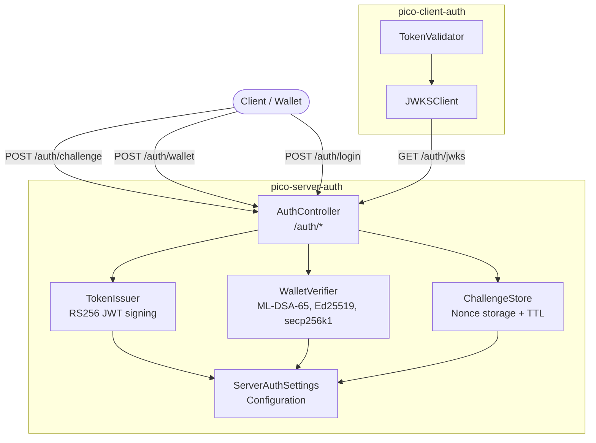
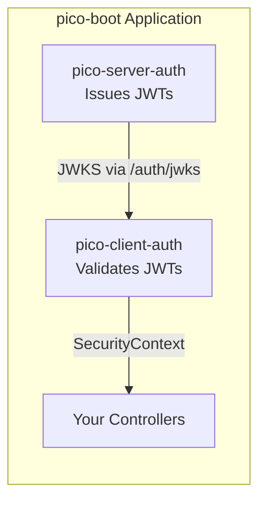
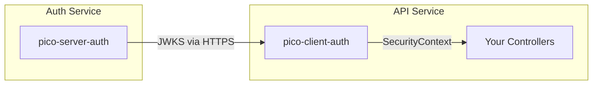
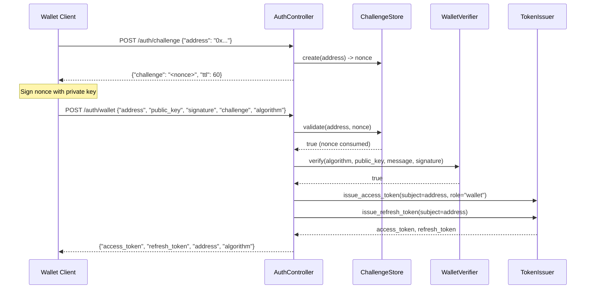

# Architecture

## Component Overview



## How It Fits with pico-client-auth

pico-server-auth **issues** tokens. pico-client-auth **validates** them. They connect via the JWKS endpoint.

**Embedded mode** (same process):



**Standalone mode** (separate services):



## Wallet Challenge/Verify Flow



## Token Issuance

`TokenIssuer` generates a fresh RSA-2048 keypair on startup (key ID: `pico-server-auth-1`). Access tokens include:

| Claim | Source |
|---|---|
| `sub` | Wallet address or email |
| `iss` | `ServerAuthSettings.issuer` |
| `aud` | `ServerAuthSettings.audience` |
| `iat` | Current timestamp |
| `exp` | `iat + access_token_expire_minutes * 60` |
| `role` | `"wallet"` or `"admin"` |
| `algorithm` | Wallet algorithm (wallet login only) |
| `wallet_address` | Wallet address (wallet login only) |

Refresh tokens include `sub`, `iss`, `aud`, `iat`, `exp`, and `"type": "refresh"`.

## Challenge Store

The `ChallengeStore` protocol defines three methods:

- `create(address) -> str` — Generate and store a nonce for the given address.
- `validate(address, nonce) -> bool` — Consume and verify a nonce (one-time use).
- `cleanup() -> int` — Remove expired entries, return count removed.

The default `InMemoryChallengeStore` stores challenges in a dict with timestamps. Each `create()` call triggers `cleanup()` to prune expired entries. Challenges are single-use: `validate()` removes the entry on lookup.

## Dependency Graph

```
pico-server-auth
  +-- pico-ioc >= 2.2.0        (DI container, @component, @configured)
  +-- pico-fastapi              (@controller, @get, @post)
  +-- pico-client-auth          (@allow_anonymous decorator)
  +-- cryptography              (RSA keys, ML-DSA-65, Ed25519, secp256k1)
  +-- python-jose               (JWT encoding)
```
