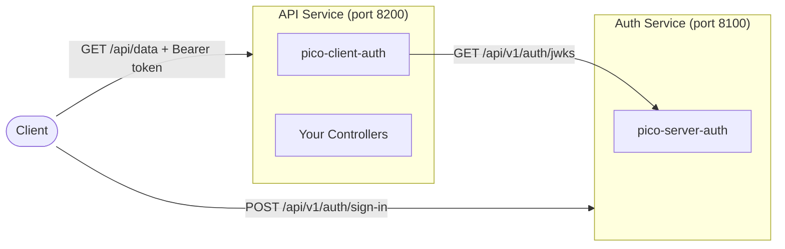

# Standalone Deployment

Deploy pico-server-auth as a dedicated auth microservice. Other services validate tokens by fetching JWKS remotely.

## Auth Service

```python
from pico_boot import Application

auth_app = Application(
    module_names=["pico_server_auth"],
    config={
        "server_auth": {
            "issuer": "https://auth.example.com",
            "audience": "my-platform",
            "access_token_expire_minutes": 15,
            "refresh_token_expire_days": 7,
            "challenge_ttl_seconds": 60,
        },
    },
)

auth_app.run()  # Runs on port 8100 (or configure via pico-boot)
```

## Downstream Services

Each downstream service runs pico-client-auth pointing at the auth service's JWKS URL:

```python
from pico_boot import Application

api_app = Application(
    module_names=[
        "pico_client_auth",
        "my_api",
    ],
    config={
        "auth_client": {
            "issuer": "https://auth.example.com",
            "audience": "my-platform",
            "jwks_url": "https://auth.example.com/api/v1/auth/jwks",
        },
    },
)

api_app.run()
```

## Architecture



## Multi-Instance Considerations

When running multiple instances of the auth service:

!!! warning "Shared challenge store required"
    The default `InMemoryChallengeStore` is per-process. If a challenge is created on instance A, it cannot be validated on instance B. Use a [custom challenge store](custom-challenge-store.md) backed by Redis or a database.

!!! warning "Shared keypair required"
    `TokenIssuer` generates a new RSA keypair on each startup. If instances have different keys, tokens issued by one instance will fail validation against another's JWKS. In production, persist and share the keypair across instances.

## Health Check

The JWKS endpoint can double as a health check since it requires the `TokenIssuer` to be initialized:

```bash
curl -f http://localhost:8100/api/v1/auth/jwks
```
